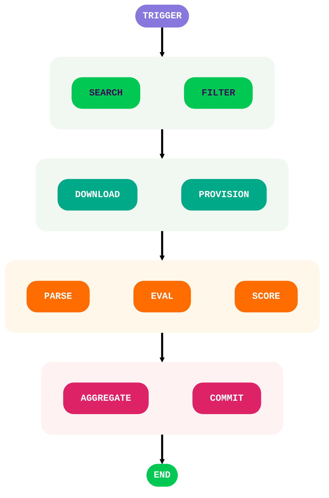

  <h1>🚧 ANTI-JUNK-BOT </h1>
  
  <h4>An automated tool that scans and reports bot-generated junk repositories to combat inauthentic activity.</h4>

---

SCAN
----
The system continuously monitors new and updated repositories for signs of automated junk or bot-generated activity.

EVALUATE
--------
For each repository, it runs a series of tests, calculates individual scores, and produces a final confidence score.

> [!Important]
> Checkout the evaluators docs
>
> [evaluators](/evals)

REPORT
------
Repositories with scores exceeding the junk threshold are logged in structured reports for further review.

The project targets repositories exhibiting patterns meant to exploit systems like the TEA scheme.

---

WORKFLOW
--------

---

License
-------
[MIT](LICENSE)
