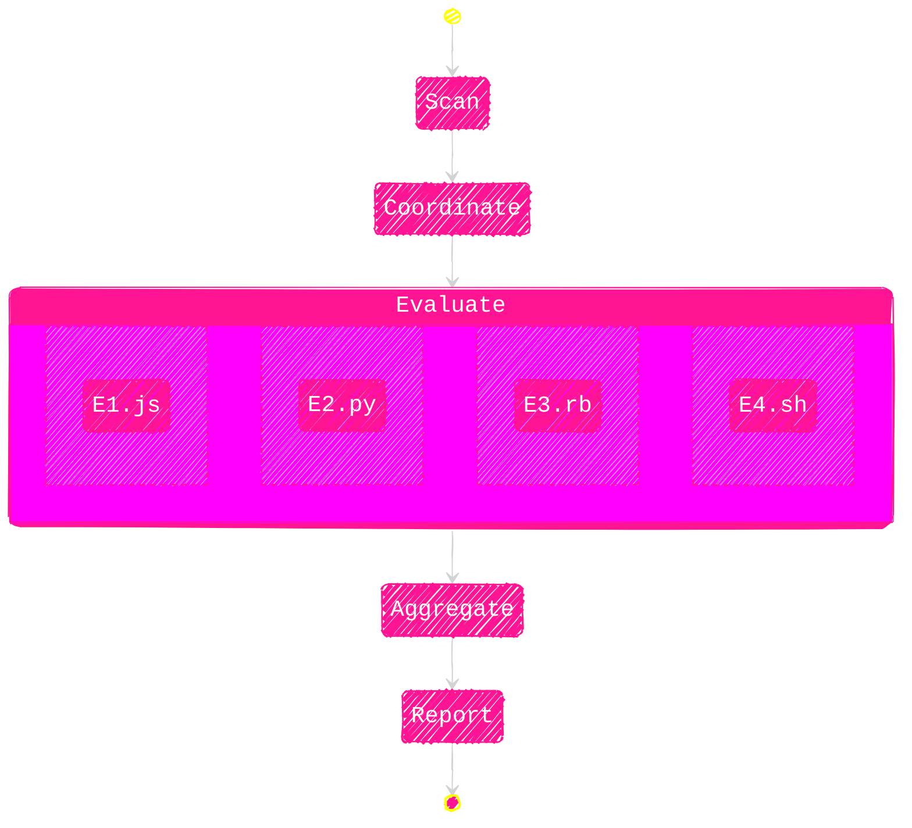

  
  <h2>JUNK-ACTIVITY</h2>
  <h3>SCANNER</h3>
  <h4>An automated tool that scans and reports bot-generated junk repositories to combat inauthentic activity</h4>

---

  <a href="#why">Why</a> |
  <a href="#key-features">Key Features</a> |
  <a href="#use-cases">Use cases</a>

 

  <a href="#process">Process</a> |
  <a href="#contribution">Contribution</a> |
  <a href="https://github.com/metaory/junk-activity-scanner/issues/new">Issue?</a>

---

WHY
---
- TODO

---

KEY FEATURES
------------
- TODO

---

USE CASES
---------
- TODO

---

PROCESS
-------

### SCAN
The system continuously monitors new and updated repositories for signs of automated junk or bot-generated activity.

### EVALUATE
For each repository, it runs a series of tests, calculates individual scores, and produces a final confidence score.

> [!Important]
> Checkout the evaluators docs
>
> [evaluators](/evals)

### REPORT
Repositories with scores exceeding the junk threshold are logged in structured reports for further review.

The project targets repositories exhibiting patterns meant to exploit systems like the TEA scheme.

---

---

CONTRIBUTION
------------

[Refer to the contribution docs for more information.](https://github.com/metaory/junk-activity-scanner?tab=coc-ov-file)

If you have any doubts related to the project or want to discuss something, then join our [Matrix server](https://matrix.to/#/#junk:gitter.im).

---

License
-------
[MIT](LICENSE)
